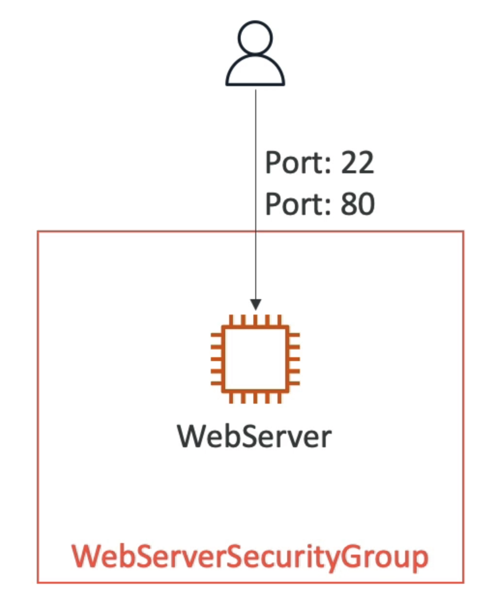

# Intorduction Example
- We are going to create a simple EC2 Instance
- And we're going to add security group to it
- For now, forget about the code syntax
- We will look at the structure of the files later

- We will how in no-time, we are able to get started with CF

# How CloudFormation Works
- Templates must be uploaded in S3 and then referenced in CF
- To update a template, we can not edit previous ones. We have to re-upload a new version of the template to AWS
- Stacks are identified by a name
- Deleting a stack deletes every single artifact that was created by CF

