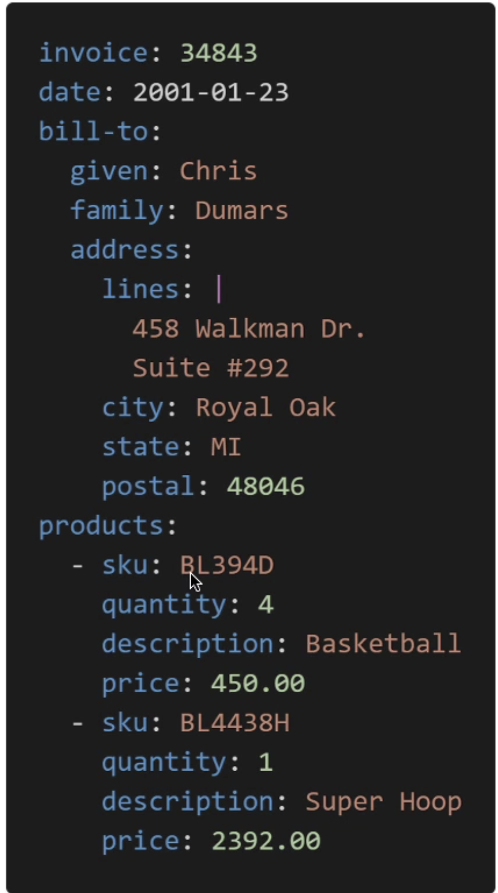

# Quick Intro To YAML
- YAML or JSON are the languages you can use for CF
- YAML is great in so many ways

### Description about YAML

- Contains:
    - Key value Pairs
    - Nested objects
    - Support Arrays
    - Multiple line strings
    - Can Support Commnents!

### JSON VS YAML
```
{
  "course": "AWS Lambda",
  "instructor": "Stephane Maarek",
  "instructor-full": {
    "first-name": "Stephane",
    "last-name": "Maarek",
    "awesomeness-level": 9000
  },
  "sections-list": [
    "Introduction",
    "Deploying your first function",
    "Learning AWS Lambda in depth",
    "Real world examples"
  ],
  "lectures": [
    {
      "lecture-id": 1,
      "lecture-name": "intro",
      "lecture-length": "5:03"
    },
    {
      "lecture-id": 2,
      "lecture-name": "aws lambda",
      "lecture-length": "10:47"
    }
  ]
}

###### YAML ########
---
course: AWS Lambda,
instructor: Stephane Maarek,
instructor-full: 
  first-name: Stephane,
  last-name: Maarek,
  awesomeness-level: 9000

sections-list:
- Introduction,
- Deploying your first function,
- Learning AWS Lambda in depth,
- Real world examples

lectures: 
- lecture-id: 1,
  lecture-name: intro,
  lecture-length: 5:03

- lecture-id: 2,
  lecture-name: aws lambda,
  lecture-length: 10:47

```