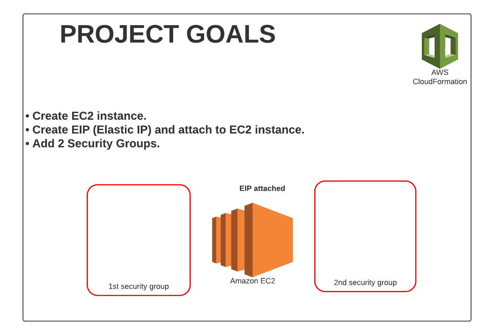

# 1Project Goals

### Summary on the CloudFormation Project1.
* <ins>Note:</ins> We will be working in **us-east-1** region.
* To update a template, we can not edit previous ones. We have to re-upload a new version of the template to AWS.
* Stacks are indentified by a name.
* Deleting a stack deletes every single artifact that was created by CloudFormation.

**Stacks must have a unique name, per your AWS account per Region.**