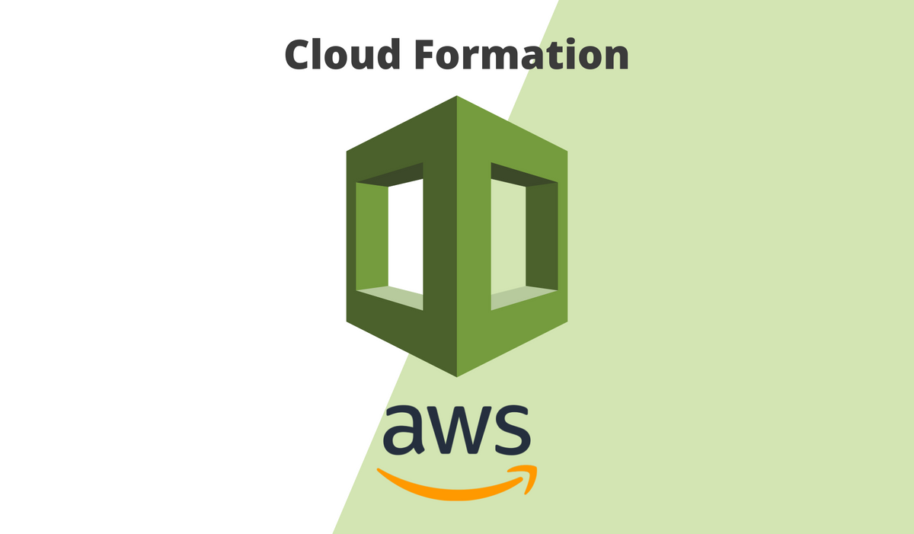

# Benefits of Cloud Formation
1. <ins>**Infrastructure as a Code**</ins>
   - No resource are manually created, which is great for control
   - The code can be version controlled for example using git.
   - Changes to the infrastructure are reviewed through code
2.  <ins>**Cost**</ins>
   - Each resource within the stack is stageed with an identifier so you can easily see how much a stack costs you.
   - You can estimate the costs of your resources using CloudFormation template.
   - Saving strategy: In Dev, you could automation deletion of templates at 5 pm and recreate it at 8 am, safely.
3.  <ins>**Productivity**</ins>
   - Ability to destroy and re-create an infrastructure on the cloud on the fly
   - Automated generation of Diagram for yuor templates!
   - Declarative programming (no need to figure out ordering and orchestration)
4.  <ins>**Separation of concern: Create many stacks for many apps, and many layers.**</ins>
- For Exapmple:
   - VPC stacks
   - Network stacks
   - App stacks
5.  <ins>**You do not have to re-invent the wheel.**</ins>
   - Leverage existing templates on the web or simply google it)
   - Leverage the documentation.

# CloudFormation vs Ansible/Terraform
* CloudFormation is AWS native, and will always contain the latest features for any AWS services.
* CloudFormation is **"state based"** and AWS will figures out how to reach that state.
* Ansible and Terraform are **"instracture based"** and be difficult to fully orchestrate your stacks. You need to sometimes make a reference to other resources in order to create.
* Ansible and Terraform have to be updated every time a new Service or API option comes form AWS, which can take a long time.
* For any heavily related AWS work it is better to use CloudFormation.