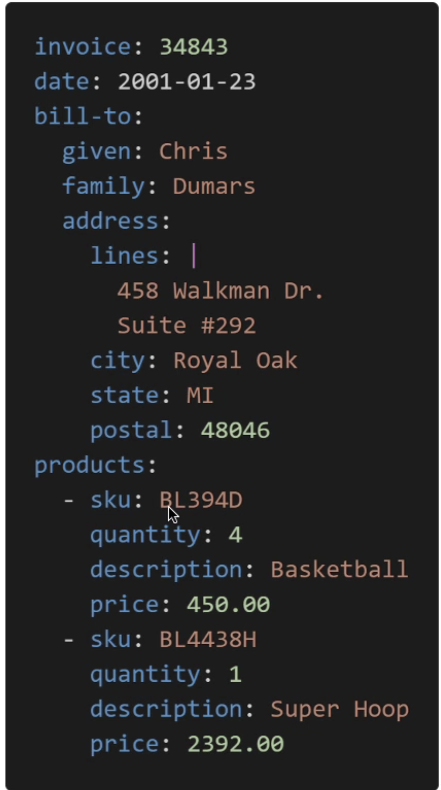

# Quick Intro To YAML
- YAML or JSON are the languages you can use for CF
- YAML is great in so many ways

### Description about YAML

- Contains:
    - Key value Pairs
    - Nested objects
    - Support Arrays
    - Multiple line strings
    - Can Support Commnents!
